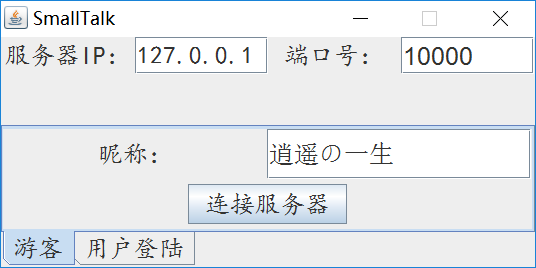

# simple-chat-room
ps1. 虽然能跑，但实际不可用。除了BUG多的缺点外，写该项目时还完全没建立“线程安全”的概念，SO ...

ps2. maven是最后加上去，但其实基本没用到，不要用maven打包运行软件。

## 一、用法

1. git clone git@github.com:xkfx/simple-chat-room.git
2. 在集成环境中将simple-chat-room文件夹作为项目打开
3. 创建数据库（Mysql） --> [schema.sql](src/main/sql/schema.sql)
4. 修改数据库的用户名和密码 --> 在[DBAccess.java](src/main/java/chatroom/server/db/DBAccess.java)中硬编码
5. 运行聊天系统服务端（可部署在远程） --> chatroom.main.ServerTest
6. 运行n个客户端 --> chatroom.client.Initializer

## 二、软件截图

### 登陆界面

### 聊天窗口

